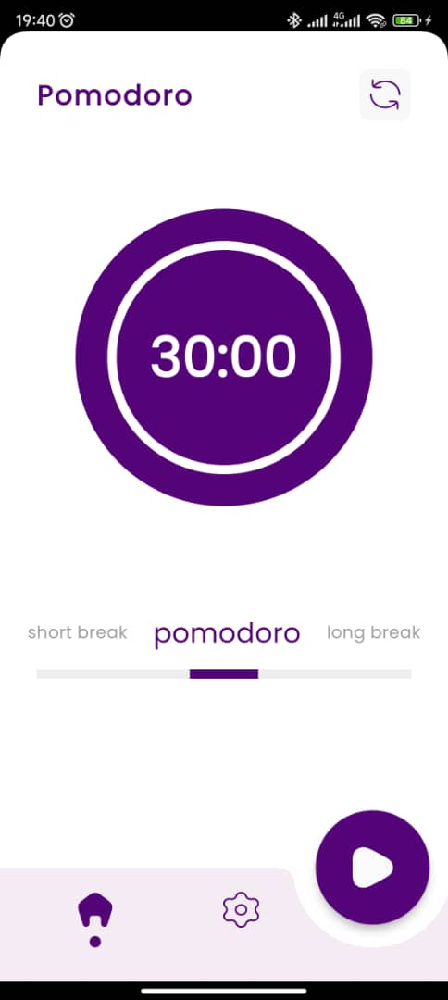
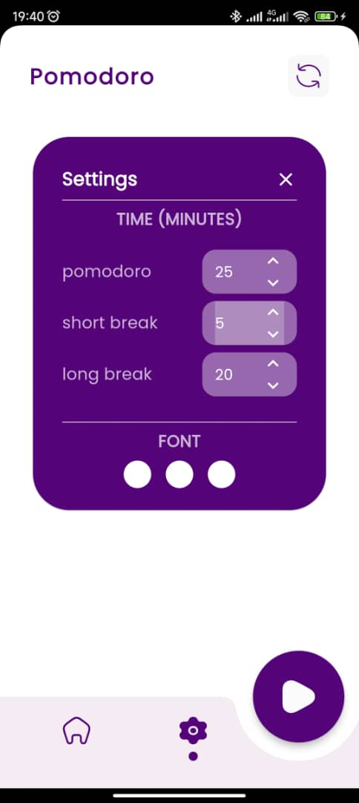

# Pomodoro App Project

## Figma Design
The reference design for this project can be found on Figma:  
[Pomodoro App Design (Community)](https://www.figma.com/design/kNYnHKfN6Pw5UAUZCw6soJ/Pomodoro-App-Design-(Community)?m=auto&t=cYytujP1HgpJ78DQ-6)  
This Figma file provides the visual structure and user interface guidelines for the application. I appriciate the designer for the meticulas design considerations.

## Icon 
The icon for this projected was generated using the following link:
https://perchance.org/ai-icon-generator

## Packages Used
## Flutter SVG for Icons
To manage icons in the app, we are using **Flutter SVG**. This makes it easy to modify icon colors dynamically, ensuring that the icons align with different themes and UI states.

## Google Fonts (Poppins)
For consistent typography, the app uses the **Poppins** font from Google Fonts, as per the design in the Figma reference. This ensures that the text styling across the app is in line with the design specifications.

## Navigation with go_router
The app’s navigation is handled using **go_router**. It simplifies route management and allows for declarative navigation, keeping the app's structure clean and easy to manage.

## Countdown Timer with circular_countdown_timer
The app features a circular countdown timer, created using the **circular_countdown_timer** package. This widget visually represents the countdown and fits the Pomodoro timer's core functionality.

## State Management with Bloc Provider
We are using **Bloc Provider** for state management. This allows for a clean separation of business logic from the UI, enabling the app to scale efficiently while maintaining code clarity and testability.

## Flutter Hive, JSON Serializable, and Hive Generator
To handle local storage and serialization, I integrated Flutter Hive, along with JSON Serializable and Hive Generator plugins. These tools facilitate smooth data management and model serialization within the app.

## Summary
This project seeks to replicate the design and functionality of the Pomodoro app from the Figma reference. Built using Flutter, the app integrates packages such as Flutter SVG, go_router, circular_countdown_timer, Hive, and more to ensure a smooth and functional experience. With a focus on clean code, scalability, and adherence to design specs, this project is a great exercise in both design and development.

# Screenshots

# Gif

